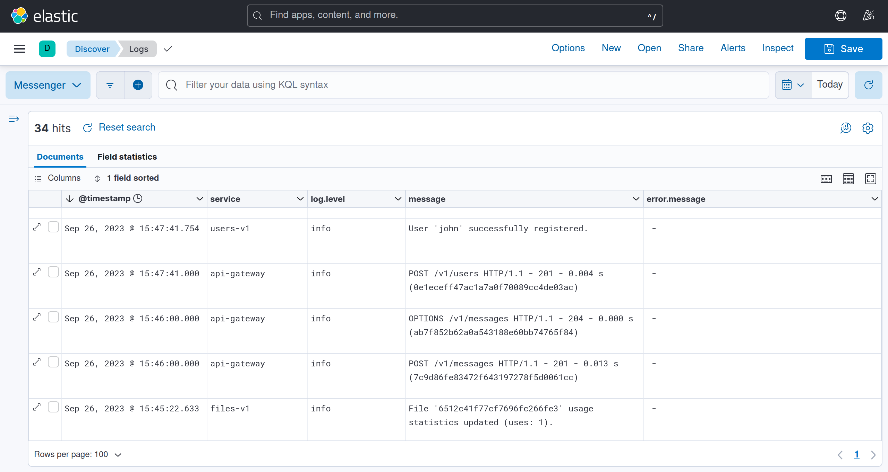

# Logs (messenger)

This is logging component of the [Messenger](https://github.com/barpav/messenger) pet-project.

## Functions

* Collecting logs from other components (Filebeat).

* Centralized logs storage (Elasticsearch).

* Logs visualization (Kibana).

See [deployment diagram](https://github.com/barpav/messenger#deployment-diagram) for details.

## Example

